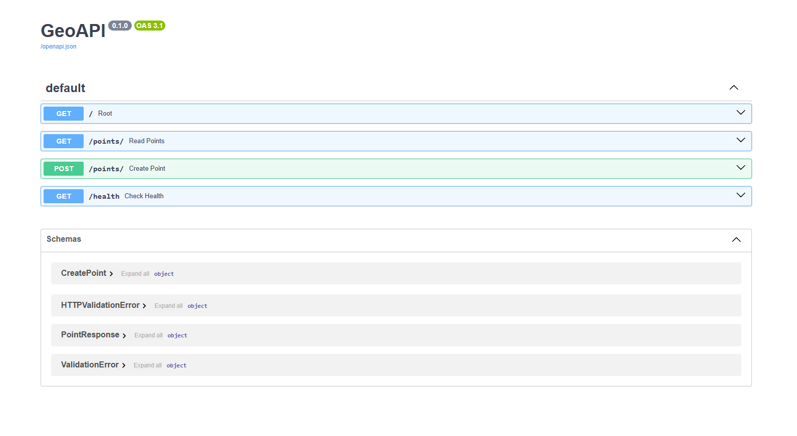

# WebGIS Backend - FastAPI & PostGIS

[🇺🇸 English](#english) | [🇧🇷 Português](#português)

---

<a name="english"></a>
## 🇺🇸 English

This is a REST API for vector data management, developed to demonstrate the integration between **Python (FastAPI)** and spatial databases (**PostGIS**).

### Technologies
* **FastAPI**: Modern, high-performance web framework.
* **PostGIS**: Spatial database extender for PostgreSQL.
* **SQLAlchemy & GeoAlchemy2**: ORM for spatial data manipulation.
* **Docker & Docker Compose**: Container orchestration for isolated environments.

### How to Run
1. Clone the repository: `git clone ...`
2. Create a `.env` file based on `.env.example`.
3. Start the environment with Docker:
   ```bash
   docker compose up -d --build

### OpenAPI Documentation


## Coordinates Reference
To get coordinates for testing, you can use: [LatLong.net Converter](https://www.latlong.net/convert-address-to-lat-long.html)


<a name="português"></a>
## 🇧🇷 Português

Este projeto é uma API REST em andamento para gerenciamento de dados vetoriais, desenvolvida para demonstrar a integração entre **Python (FastAPI)** e bancos de dados espaciais (**PostGIS**). Atualmente, somente geometria de pontos são suportadas.

### Tecnologias Utilizadas
* **FastAPI**
* **PostGIS**
* **SQLAlchemy & GeoAlchemy2**
* **Docker & Docker Compose**

### Como rodar
1. Clone o repositório: `git clone ...`
2. Crie um arquivo `.env` baseado no `.env.example`.
3. Suba o ambiente com Docker:
   ```bash
   docker compose up -d --build

### Referência de Coordenadas
Para obter coordenadas de teste, você pode utilizar:[LatLong.net Converter](https://www.latlong.net/convert-address-to-lat-long.html)
